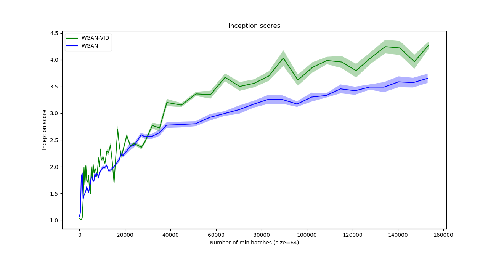
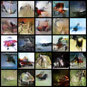
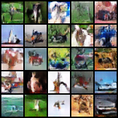

# Variational information distillation (VID) for accelerating Wasserstein GAN

This repository consists of code for an extra experiment for our [CVPR paper](https://arxiv.org/abs/1904.05835).

## The main idea of VID

The idea is to introduce a data-dependent regularizer for deep neural network training.
The regularizer is defined by the mutual information between the activations of the teacher network and the student network, 
where the teacher network is pretrained (possibly on another dataset). 

## An application to GAN

One difficulty in GAN is that the discriminator is not informative enough 
when the generated samples are clearly different from real samples.
A pretrained discriminator obtained from another image generation task
may not be able to tell whether a sample is real but it should be able 
to detect most of fake samples, since it has seen so many fake samples from its previous experience.
By leveraging the teacher's discriminator, the objective for the student's discriminator additionally contains the term *-lambda * I(D_s; D_t).*

## Experiments on CIFAR10

The teacher's discriminator 

>Conv2d(128) -> LeakyReLU -> Conv2d(256) -> LeakyReLU -> Conv2d(512) -> LeakyReLU -> Linear.

The student's discriminator

>Conv2d(32) -> LeakyReLU -> Conv2d(64) -> LeakyReLU -> Conv2d(128) -> LeakyReLU -> Linear.

The mutual information terms are added before each LeakyReLU, where lambda = 0.001.

The WGAN code is adapted from [wgan-gp](https://github.com/caogang/wgan-gp/blob/master/gan_cifar10.py) and [pytorch-wgan](https://github.com/Zeleni9/pytorch-wgan).

As a comparison, adding VID achieves higher inception scores except at the beginning. 

<!---

-->


Qualitatively, the samples of WGAN and WGAN-VID are shown below

 &nbsp; &nbsp;&nbsp; &nbsp;&nbsp; &nbsp; 

## Commands

Running WGAN:

```
python wgan_baseline.py --dir CIFAR10_base_nh32 --dataset cifar --n_h 32
```

Running WGAN-VID:

```
python wgan_vid.py --dir CIFAR10_student_nh32 --dataset cifar --n_critic 1 --thin_factor 4 --lambda_distil 1e-3 
```
